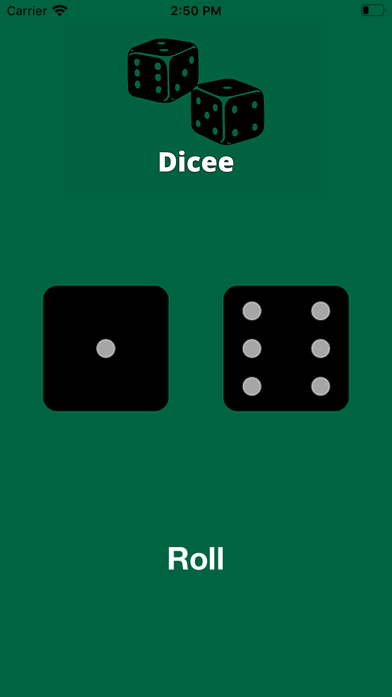

#  Dicee
    This application is included in TheAppBrewery's iOS Application Development Bootcamp.
An iOS Application which displays random Images of sides of dice when a Button is pressed.

## Technologies
<a href="https://developer.apple.com/documentation/uikit"> UIKit </a> - Construct and manage a graphical, event-driven user interface for your iOS or tvOS app.
- <a href="https://developer.apple.com/documentation/uikit/uiimageview"> UIImageView </a> - An object that displays a single image or a sequence of animated images in your interface.
- <a href="https://developer.apple.com/documentation/uikit/uibutton"> UIButton </a> - A control that executes your custom code in response to user interactions.

## Screenshot

